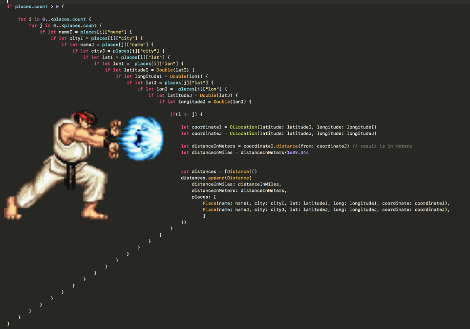

# flutter_workshop

### Dart clean code
https://github.com/williambarreiro/clean-code-dart

### Pyramid of Doom
https://en.wikipedia.org/wiki/Pyramid_of_doom_(programming)

## Project related

**Rick and Morty API**\
https://rickandmortyapi.com/api/character/?page

**build runner**\
`flutter packages pub run build_runner build --verbose --delete-conflicting-outputs`